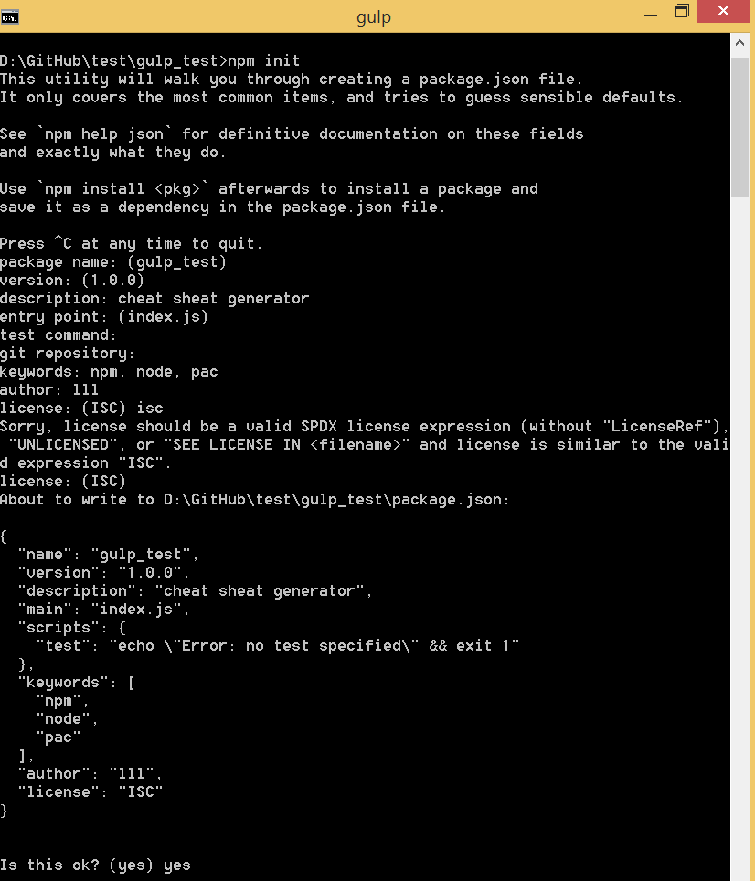
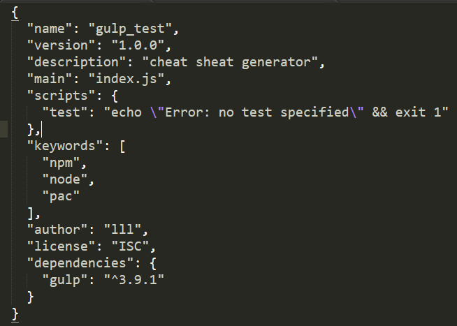
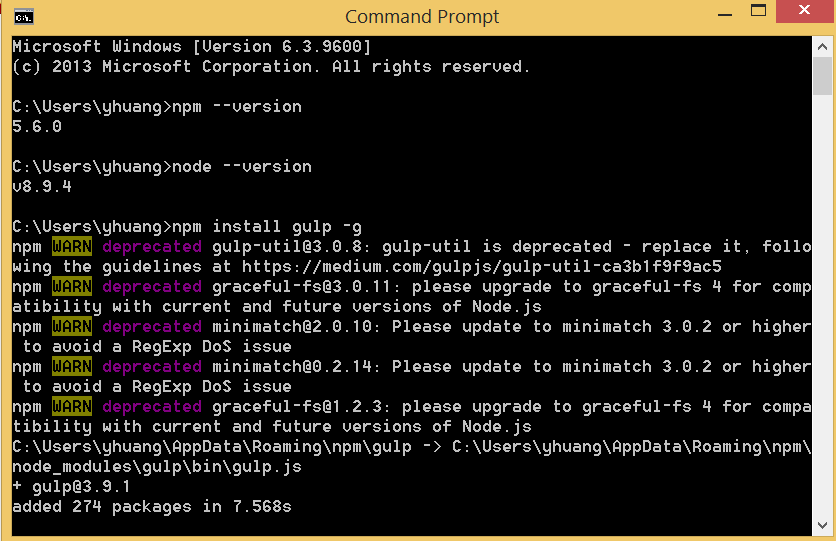
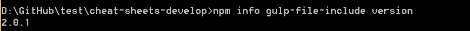
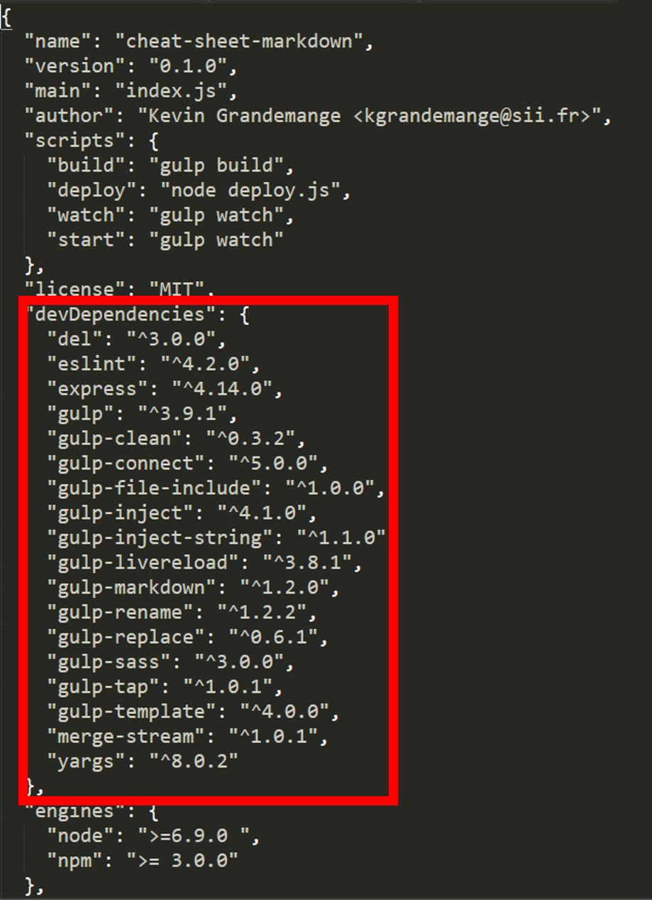
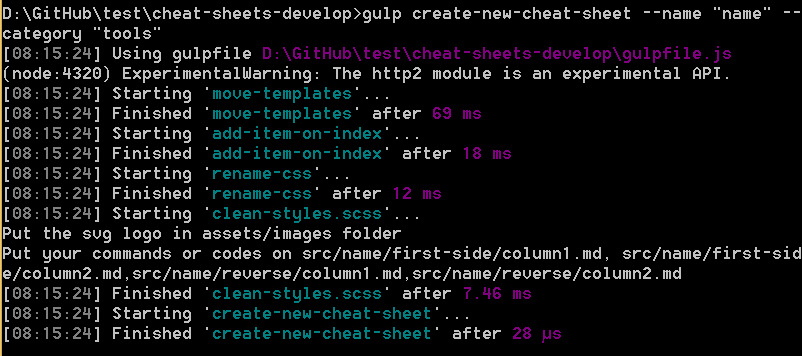
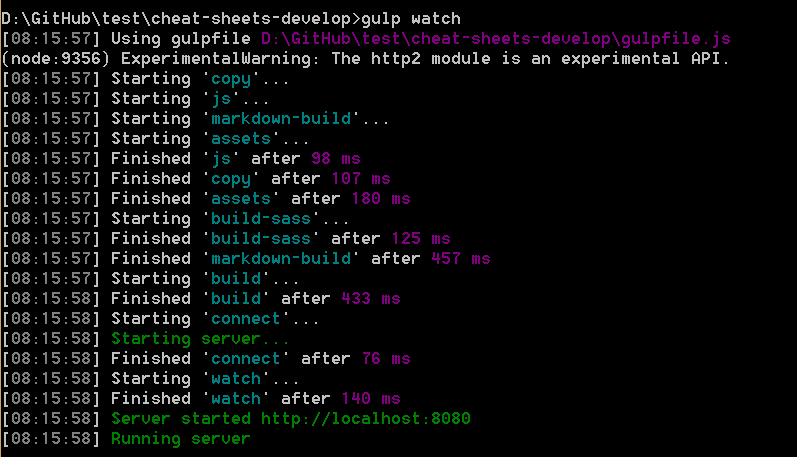

# npm

## Getting Started

* Download and install node.js
The npm command-line tool is bundled with Node.js. If you have it installed, then you already have npm.

[npm link](https://www.npmjs.com/) 

The **node.js** used is Version: 8.9.4 (includes npm 5.6.0)

[node.js link](https://nodejs.org/en/download/)

* Check if **npm** was installed successfully.
installation check
```sh
node --version
npm --version
```

* Define your project directory
* Create package.json
```sh
npm init
```




* Install **gulp**
```sh
npm install gulp -g 
```
# tells NPM to install gulp locally and save this dependency information in the package.json file
```sh
npm install gulp --save-dev  
```



* create gulpfile.js
```javascript
var gulp = require('gulp');
gulp.task('default', function () { 
    console.log('Hello Gulp!') 
});
```

* Test your gulp function
```sh
gulp
```

* Check the latest version of a package
```sh
npm info package_name version
```



* Install the dependencies defined in package.json
```sh
npm install
```

* Uninstall the package
```sh
npm uninstall package_name
```




* Create new cheat sheet
```sh
gulp create-new-cheat-sheet --name "cheat sheet name" --category "tools name"
```
or
```sh
gulp create-new-cheat-sheet --name "cheat sheet name" --category "frameworks name"
```
or
```sh
gulp create-new-cheat-sheet --name "cheat sheet name" --category "languages name"
```




* launch on local server
```sh
gulp watch
```




* Put your svg|png logo in 
```sh
assets/images
```

* Put your commands or codes on:

```sh
src/<name>/first-side/column1.md
src/<name>/first-side/column2.md
src/<name>/reverse/column1.md
src/<name>/reverse/column2.md
```

* Template

[first-side/column1.md](../template/first-side/column1.md)

[first-side/column2.md](../template/first-side/column2.md)

[reverse/column1.md](../template/reverse/column1.md)

[reverse/column2.md](../template/reverse/column2.md)

* Change layout in 

`src/index.html`